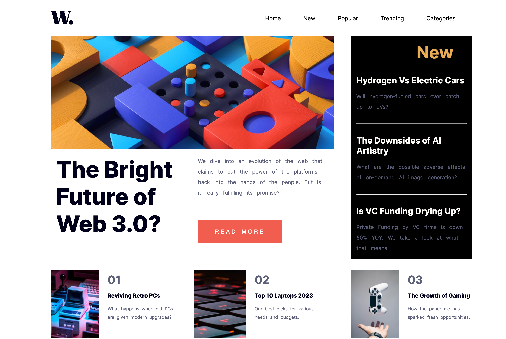

# Frontend Mentor - NewsPage solution


## Overview

### The challenge

Users should be able to:

- View the optimal layout depending on their device's screen size

### Screenshot




### Links


- Live Site URL: [newspage-marvisdev.com](https://marvischief.github.io/newspage.github.io/)

## My process

### Built with

- Semantic HTML5 markup
- CSS custom properties
- Flexbox
- Mobile-first workflow

### What I learned

I learned how to build a landing page component responsive for both larger and smaller devices media width and how to properly use media ports in CSS without the aid of frameworks

CODE SNIPPETS;

```html
<h1>Some HTML code I'm proud of</h1>
```
```css
@media only screen and (max-width:480px){
    /* For mobile below 480px */
    [class="card"]{
        display: flex;
        flex-direction: column-reverse;
        width: 90%;
        margin-left: auto;
        margin-right: auto;
        margin-top: 100px;
        margin-bottom: 100px;
        text-align: center;
    }

    [class="stats"] {
        display: block;
        align-content: center;
    }
    [class="headings"] {
        margin-left: 20px;
        margin-right: 20px;
    }
    [class="stats1"]{
    
        margin-left: 35%;
        margin-top: -10px;
        margin-bottom: 30px;
        
    }
    p {
        line-height: 1.5rem;
    }
    img {
        border-top-left-radius: 10px;
        border-bottom-right-radius: 0;
    }
}
```

## Author

- Website - [Chief Marvis](https://www.github.com/Marvischief)
- Twitter - [@igbokwe_marvis](https://www.twitter.com/igbokwe_marvis)
